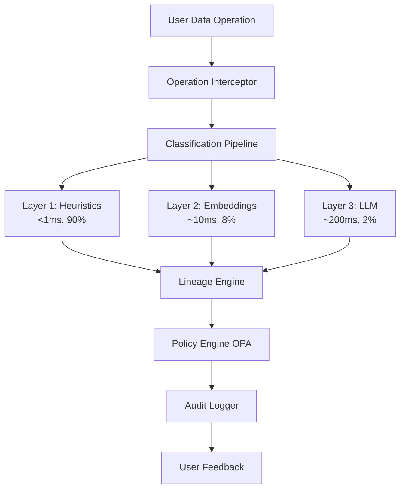

# Lacuna

**Protected space for data governance, lineage, and privacy-aware operations**

[](https://opensource.org/licenses/Apache-2.0)
[](https://github.com/witlox/lacuna/actions/workflows/build.yml)
[](https://github.com/witlox/lacuna/actions/workflows/test.yml)
[](https://codecov.io/gh/witlox/lacuna)

---

## Overview

Organizations deploying local LLMs and data platforms face a critical challenge: **How do you enable self-service data access while maintaining governance, lineage tracking, and compliance?**

Current solutions force a choice between:

- **Strict centralized control** → Bottlenecks, slow innovation
- **Complete self-service** → Compliance violations, data leaks, audit failures

**Lacuna solves this** by creating a protected space where sensitive data stays secure while enabling self-service access within compliance boundaries.

## What is Lacuna?

Lacuna is a **policy-aware data governance engine** that provides:

<div class="grid cards" markdown>

- :material-shield-check: **Automatic Classification**

    Three-layer pipeline (heuristics → embeddings → LLM) classifies data operations in real-time

- :material-gavel: **Policy Enforcement**

    Real-time policy evaluation with clear, actionable feedback to users

- :material-family-tree: **Complete Lineage**

    Automatic tracking across transformations, joins, and exports

- :material-file-document-check: **Audit Compliance**

    ISO 27001-compliant logs with tamper-evident hash chains

- :material-puzzle: **Easy Integration**

    Works with dbt, Databricks, Snowflake, and Open Policy Agent

- :material-speedometer: **High Performance**

    <10ms classification for 98% of operations

</div>

## Key Features

### Three-Layer Classification Pipeline

Lacuna achieves 98%+ throughput at <10ms latency through an intelligent pipeline:

- **Layer 1: Heuristics** - Regex patterns and keyword matching handle 90% of operations in <1ms
- **Layer 2: Embeddings** - Semantic similarity for 8% of operations in ~10ms
- **Layer 3: LLM Reasoning** - Complex decisions for 2% of operations in ~200ms

### Sensitivity Tiers

All data is classified into three tiers:

| Tier | Definition | Examples |
|------|------------|----------|
| **PROPRIETARY** | Competitive advantage or confidentiality concerns | Customer PII, proprietary algorithms, strategic plans |
| **INTERNAL** | Within organization but not sensitive | Internal tooling, team processes, general analytics |
| **PUBLIC** | Publicly available or publishable | Documentation, open-source code, published research |

!!! note "Classification Inheritance"
    When data is joined or transformed, the most restrictive tier propagates. For example: `PUBLIC + PROPRIETARY = PROPRIETARY`

## Quick Start

### Development Mode

Try Lacuna locally with zero external dependencies:

```bash
# Clone and install
git clone https://github.com/witlox/lacuna.git
cd lacuna
pip install -e .

# Start in dev mode (uses SQLite, no external dependencies)
lacuna dev

# Open in browser
# API Docs: http://127.0.0.1:8000/docs
# User Dashboard: http://127.0.0.1:8000/user/dashboard
# Admin Dashboard: http://127.0.0.1:8000/admin/
```

### Production Deployment

For production with full features:

=== "Docker"

    ```bash
    docker pull ghcr.io/witlox/lacuna:latest
    docker run -d -p 8000:8000 ghcr.io/witlox/lacuna:latest
    ```

=== "Docker Compose"

    ```bash
    # Production stack
    docker compose -f deploy/docker/docker-compose.prod.yaml up -d

    # High-availability with replication
    docker compose -f deploy/docker/docker-compose.ha.yaml up -d
    ```

=== "Kubernetes"

    ```bash
    helm install lacuna ./deploy/helm/lacuna \
      -f deploy/helm/lacuna/values-production.yaml
    ```

=== "pip"

    ```bash
    pip install lacuna
    lacuna serve --host 0.0.0.0 --port 8000
    ```

## Use Cases

### Real-Time Policy Enforcement

```python
# User's notebook
import pandas as pd

customers = pd.read_csv("customers.csv")
# ✓ Lacuna detects: PII data loaded, context updated

analysis = customers.merge(sales, on="customer_id")
# ✓ Lacuna classifies: PII propagates through join

analysis.to_csv("~/Downloads/export.csv")
# ✗ Lacuna blocks with clear message:
"""
❌ Governance Policy Violation

Action: Export to ~/Downloads/export.csv
Reason: Cannot export PII data to unmanaged location
Classification: PROPRIETARY (inherited from customers.csv)
Tags: PII, GDPR, FINANCIAL

Alternatives:
1. Use anonymized version: analysis_anon = anonymize(analysis, ['customer_id', 'email'])
2. Save to governed location: analysis.to_csv("/governed/workspace/analysis.csv")
3. Request exception: https://governance.example.com/exception

Policy: P-2024-001 (PII Export Restrictions)
Steward: data-governance@example.com
"""
```

### Automated Lineage Tracking

```python
from lacuna import LineageTracker

# Query lineage
lineage = LineageTracker.get_lineage("analysis.csv")

print(lineage.to_graph())
"""
analysis.csv (PROPRIETARY, tags: PII, GDPR, FINANCIAL)
├─ customers.csv (PROPRIETARY, tags: PII, GDPR)
│  └─ raw.customer_master (PROPRIETARY, tags: PII)
│     └─ salesforce.contacts (PROPRIETARY, tags: PII)
└─ sales.csv (INTERNAL, tags: FINANCIAL)
   └─ raw.transactions (INTERNAL, tags: FINANCIAL)
"""

# Check downstream impact
downstream = LineageTracker.get_downstream("customers.csv")
print(f"Changing customers.csv will impact {len(downstream)} artifacts")
```

### ISO 27001 Compliance

```python
from lacuna.audit import ComplianceReporter

# Generate ISO 27001 A.9.4 report (Access Control)
report = ComplianceReporter.generate_a_9_4_report(
    start_date="2025-01-01",
    end_date="2025-12-31"
)

# Report includes:
# - All data access attempts (successful and failed)
# - Classification decisions with reasoning
# - Policy violations with user responses
# - Administrative actions
# - Complete audit trail with hash chain verification
```

## Architecture



## Why Lacuna?

### The Name

**Lacuna** (Latin): A gap, cavity, or protected space

In anatomy, a lacuna is a small cavity that protects cells. In manuscripts, it's a missing section that reveals what's intentionally kept private.

In data governance, Lacuna creates the protected space where:

- Sensitive data stays secure
- Appropriate data flows freely
- Boundaries are enforced automatically

### The Market Gap

Existing solutions address either data catalogs, access control, DLP, or policy engines - but none combine all four.

**Lacuna uniquely provides:**

- Real-time operation interception
- Automatic classification with lineage
- Policy enforcement with user feedback
- ISO 27001-compliant audit logging
- Self-service model with central governance

### Who This Is For

**Organizations:**

- Enterprises with data governance requirements
- Regulated industries (finance, healthcare, government)
- Companies with proprietary data assets
- Teams deploying local data platforms

**Users:**

- Data analysts (self-service access)
- Data engineers (building pipelines)
- Data governance teams (defining policies)
- Compliance officers (audit reports)
- Security teams (monitoring access)

## Next Steps

<div class="grid cards" markdown>

- :material-rocket-launch: **[Quick Start Guide](getting-started/quick-start.md)**

    Get up and running in minutes

- :material-book-open-variant: **[User Guide](USER_GUIDE.md)**

    Learn how to use Lacuna's features

- :material-cog: **[Architecture](ARCHITECTURE.md)**

    Understand how Lacuna works

- :material-api: **[API Reference](api/rest.md)**

    Integrate Lacuna into your stack

</div>

## Community

- **GitHub**: [witlox/lacuna](https://github.com/witlox/lacuna)
- **Issues**: [Report bugs or request features](https://github.com/witlox/lacuna/issues)
- **Discussions**: [Ask questions](https://github.com/witlox/lacuna/discussions)

## License

Lacuna is licensed under the [Apache 2.0 License](license.md).
